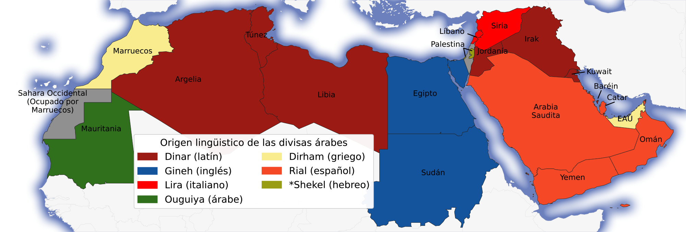

# El origen lingüístico de las denominaciones de las divisas árabes
### Historia y mapa. 

De los varios nombres que tienen las distintas divisas árabes, sólo una es de origen árabe, la de Mauritania. El resto, son préstamos de lenguas extranjeras:

| Transliteración | Árabe | Nombre original  | Idioma original |
| --------------- | ----- | ---------------- | --------------- |
| Dinar           | دينار | Dēnārius         | Latín           |
| Lira            | ليرة  | Lira             | Italiano        |
| Riyal           | ريال  | Real             | Español         |
| Dirham          | درهم  | Drakhma (δραχμή) | Griego          |
| Gineh           | جنيه  | Guinea           | Inglés          |
| Ouguiya         | أوقية | Ouguiya (أوقية)  | Árabe           |
| Shekel          | شيقل  | Shekel (שקל)     | Hebreo          |

**Dinar (دينار):**
La moneda de Argelia, Túnez, Libia, Jordania, Iraq, Kuwait, y Baréin. Viene de "denarius", el denario romano. Seguramente se introdujo al árabe a través del arameo, que era lengua franca en la zona del levante en el momento del surgimiento del Islam, y de la conquista árabe del levante.

**Lira (ليرة):**
La moneda de Siria y Líbano. También es de origen latino, pero fue introducida en la época otomana, en su versión italiana, "libra", y estos dos países eran parte del Imperio Otomano antes de quedar bajo dominio francés. Otros países árabes habían usado esta denominación para sus divisas, pero la abandonaron en favor de otras.

**Riyal (ريال):**
La moneda de varios países del golfo: Arabia Saudí, Yemen, Omán, y Qatar. Para sorpresa de algunos, también es de origen latino, es un préstamo del español, viene del "real", moneda que fue introducida en la época del imperio español, y que circuló en el comercio internacional, en medio oriente, algunas otras monedas occidentales también fueron conocidas bajo ese nombre. 

**Dirham (درهم):**
La moneda de Marruecos y Emiratos Árabes Unidos, viene del griego "drakhma", moneda de uso común en el Imperio Bizantino, además del griego ser su lengua administrativa. Fue introducida a Arabia mediante el comercio desde antes del islam, y posterior a las conquistas islámicas, los nuevos gobernantes empezaron a acuñar sus propias monedas. 

**Gineh (جنيه):**
En español, es llamada también libra, pero en árabe es gineh, o jineh. Es un préstamo del inglés, "guinea", la moneda de oro de acuñada en el golfo de guinea controlada por Inglaterra. Tanto sudán como egipto, estuvieron bajo influencia colonial inglesa. 

**Ouguiya (أوقية):**
Es el único nombre de origen árabe, y significa onza.

*(Bonus)*

__\*Shekel:__
No es la moneda del Estado de palestina, sino de Israel, pero es la de mayor circulación en los territorios palestinos, y aunque no sea su moneda oficial, lo es de facto. 

