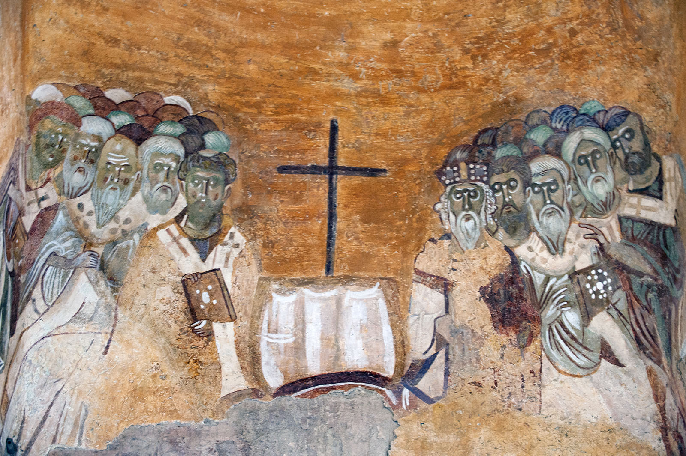

# Ramas del cristianismo
## desde un punto de vista político y étnico.

1. El imperio romano fue multiétnico, multilingüe, y multirreligioso. El intercambio como consecuencia del imperialismo romano fue muy fluido y en varias direcciones. Antes de los romanos, la región de judea había sido conquistada por los griegos, quienes tuvieron gran influencia en la región, la cual sobrevivió a la conquista romana. De hecho, el griego fue la lingua franca de la parte oriental del imperio romano hasta su caída. En este contexto, los judíos empezaron a recibir influencia extranjera, además de existir también la diáspora que vivía cada vez más en ambientes no-judíos, hasta que se surgieron grupos favorables a la influencia griega y partidarios de algunas de sus instituciones e ideas, que se conocieron como los “helenizantes”, que también influyeron en la teología al incluir algunos aspectos de la filosofía griega en la interpretación de los textos religiosos. Por supuesto, estos grupos también generaron algunos detractores en la sociedad judía de los tiempos romanos, existiendo otros grupos pragmáticos (cooperación con los ocupantes), aislacionistas (que buscaban mantener la pureza del judaísmo mediante la segregación), y otros abiertamente subversivos que pensaban que la tierra de Canaán debía ser gobernada por los judíos. 
    
2. El cristianismo fue un movimiento religioso de matriz judía, que se extendió por todo el imperio romano, ya que, a diferencia del judaísmo tradicional, éste tenía una fuerte vocación proselitista: *“Acercándose, Jesús les dijo: «Yo he recibido todo poder en el cielo y en la tierra. Vayan, y hagan que todos los pueblos sean mis discípulos, bautizándolos en el nombre del Padre y del Hijo y del Espíritu Santo, y enseñándoles a cumplir todo lo que yo les he mandado. Y yo estaré siempre con ustedes hasta el fin del mundo».”* Mateo 28:18-20.
   
   Los evangelios fueron escritos en griego, lingua franca de la parte oriental del imperio romano, pero su expansión fue más allá de una región o etnia del imperio romano, esta diversidad y falta de institucionalidad creó una enorme fragmentación política, cultural e ideológica. En un principio, se consideraba como una corriente judía, y no una religión distinta, pero cada vez ganaba más adeptos gentiles, los cuales según los hechos de los apóstoles, no necesitaban convertirse al judaísmo ni observar sus leyes. Aún así, en Judea los cristianos tenían un origen eminentemente judío y es probable que haya atraído a comunidades judías "helenizantes".
   
   La diferenciación fue progresiva, tanto entre judíos y cristianos, como por las autoridades romanas, los cuales tenían una administración y burocracia precisa para tratar con las religiones del imperio, las discrepancias y tensiones, entre la comunidad judía más tradicional orientada al templo y una secta heterodoxa eran claras, puede considerarse un momento clave la revuelta de **Bar Kojba** (132-136), en la que muchos judíos consideraron mesías, cuestión problemática para los Cristianos que creían que el Mesías era Jesús, y que por lo tanto ya había llegado, y no participaron de la rebelión.
   
   Los romanos habían dado reconocimiento legal a los judíos, y estaban eximidos de participar en los cultos romanos, pero los cristianos, al ser considerado un culto distinto (y fuera de la ley)  no gozaban de tales privilegios, por lo que sí estaban obligados a participar de los cultos romanos como muestra de lealtad al imperio, además, dada su vocación proselitista, se había expandido a muchas comunidades no judías, por lo que estaban generando falta de lealtad en pueblos que hasta ese entonces, participaban de las ceremonias romanas.

  
  
  

y constantino luego de . Y no hay ninguna iglesia con continuidad hasta hoy que pueda decirse “no niceana”Primer cisma, el nestoriano:

1. La iglesia nestoriana encontró refugio fuera del imperio romano, en el imperio sasánida, aunque la comunidad y su liturgia era asiria
    

2. El segundo cisma, de la iglesia oriental, fue seguido por la iglesia armenia, fuera de los límites romanos, por la copta y por la siriaca occidental, esto hizo entrar en conflicto al patriarcado copto con el resto. La comunidad siriaca compartía espacio con la comunidad helenizada, que seguía el cristianismo calcedonio con la liturgia bizantina en el levante. Los seguidores de la fe calcedonia empezaron a ser llamados melquitas. 
    
3. El gran cisma divide a la iglesia romana occidental de la oriental (bizantina) por la rivalidad de ambas ciudades. el patriarca de roma con el apoyo occidental frente a los otros tres patriarcas, constantinopla, antioquía y jerusalén.
    
4. La iglesia católica, que es más grande que todas las otras iglesias juntas, intentó restaurar la comunión con el resto de iglesias con distinto éxito, aunque en ninguna pudo quedarse con todos los fieles,
    

**