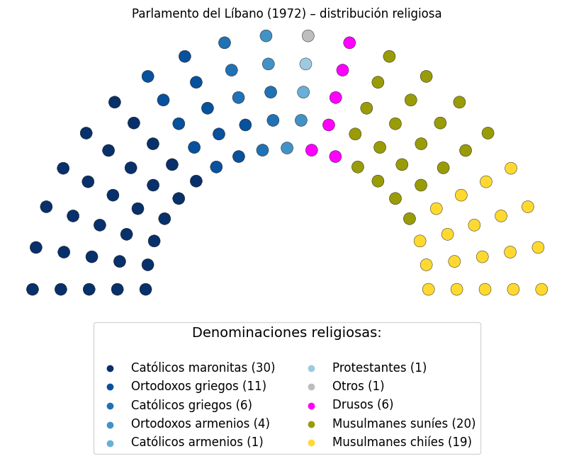

# La guerra sectaria de Israel contra el Líbano:
## Parte 1

### Contexto

Cada país árabe es diferente, pero Líbano es con frecuencia considerado el más singular de todos, si bien, su influencia cultural no es la más grande (cuyo lugar le corresponde a Egipto), esta supera por mucho su pequeño tamaño y población.  Una de sus peculiaridades, es que tiene la mayor proporción de cristianos, aproximadamente un tercio, de las cuales la más influyente y distintiva es la Iglesia Maronita: culturalmente pertenece al cristianismo siriaco, y como tal, su biblia es la peshitta, pero teológicamente, es católica, estando en comunión con Roma desde los tiempos de las cruzadas.

La convivencia de los cristianos con otros grupos del Líbano depende del periodo y la región: no fue violencia constante por parte de los musulmanes como dicen los orientalistas de derecha, ni siglos de idílica armonía hasta que irrumpe el colonialismo, como dicen los orientalistas de izquierda, sin embargo, al estar los cristianos en desventaja durante la mayor parte de la historia, cuando la tensión era alta, los cristianos tenían las de perder.

Otro grupo muy representativo del Líbano, son los drusos, que son poco menos del 10% y que en algunas interpretaciones, son junto con los maronitas, el núcleo de la conformación del Líbano, sin embargo, en las demarcaciones bajo el dominio francés, se incluyeron áreas circundantes habitadas mayoritariamente por musulmanes (chiítas y sunitas) formando el "Gran Líbano" que son las fronteras del país moderno.

Los musulmanes, son poco más del 50%, siendo en la actualidad, casi la misma cantidad de chiítas y sunitas (al menos los ciudadanos, pero las estadísticas no suelen considerar ni a los refugiados sirios ni palestinos). Al principio de la independencia, los sunitas tenían mayor influencia y mejores condiciones sociales que los chiítas, quienes eran socialmente más desfavorecidos que otros grupos libaneses, y dada sus peores condiciones generales, tenían una mayor tasa de fecundidad.

Los políticos israelíes al momento de la fundación de su Estado, pensaban que Líbano sería uno de los primeros, sino el primero, en reconocer su independencia y establecer relaciones formales, pero los acontecimientos demostraron que no podrían estar más equivocados. Décadas después, Líbano no sólo no ha establecido relaciones con Israel, sino que, es su principal dolor de cabeza entre los países árabes, la razón tiene nombre de partido político: hezbollah.

#### Del nacimiento de la república a la guerra civil

Cuando el Imperio Otomano sucumbió ante las potencias occidentales, la zona de Líbano y Siria quedó bajo el mandato Francés, que oficialmente era un tutelaje para que estos lograran establecerse como Estados independientes. Separar el Líbano de Siria, tenía como objetivo que los cristianos tuvieran la protección de un Estado en el que fueran mayoría, para garantizar esto, diseñaron el sistema confesional, que asignaba cuotas fijas a las sectas religiosas oficialmente reconocidas, asegurando una mayoría cristiana en el parlamento (proporción 6:5 a favor de los cristianos) y un presidente maronita. Parte de los cristianos, especialmente de los maronitas, vieron positivamente la influencia francesa y occidental, siendo más receptivos que otras comunidades a la Educación e instituciones occidentales que otras sectas, en parte porque muchas de estas cuestiones venían de la mano de misioneros extranjeros, y al ser los maronitas una denominación católica, al menos en términos teológicos no había contradicción, esto les dio cierta ventaja en el mundo moderno, al que se adaptaron de mejor forma.

Luego de formada la república libanesa en 1943, los chiítas al ser una comunidad eminentemente desfavorecida, empezó a ser atraída por movimientos de tinte socialista o de izquierda, no obstante, al igual que en Latinoamérica, empiezan a surgir clérigos cada vez más comprometidos con las cuestiones sociales, y por lejos, el más influyente fue Musa al-Sadr, cuyos partidarios terminan fundando el partido Amal. Si bien, el partido Amal atraía básicamente a población chiíta, no era un partido que buscara el establecer un Estado Islámico, sino que inspirados en el pensamiento religioso, mejorar las condiciones de vida de los libaneses desfavorecidos en general y los chiítas en particular. Este partido, terminaría recibiendo apoyo sirio, y alineándose con sus intereses en el Líbano.

Al estallar la guerra entre israelíes y árabes en el 48, muchos palestinos fueron desplazados a otros territorios de palestina o de los países circundantes, entre ellos, Líbano, en el que se formaron campamentos de refugiados. Durante la primera guerra, los palestinos no tenían una fuerza propia, sino que eran milicias locales y ejércitos del resto de los países árabes, pero en 1964 se funda finalmente la OLP como organización netamente palestina dedicada a su liberación y autodeterminación. Luego vino la guerra del 67 iniciada por Israel oficialmente como ataque "preventivo", donde Israel toma toda la tierra palestina y más palestinos fueron forzados a desplazarse (especialmente aquellos vinculados con la OLP), lo que consolidó su presencia en otros países como refugiados, siendo el mayor número asentado en el Reino de Jordania.

La OLP, ahora en el exilio, empezó a organizar ataques desde el extranjero, lo que provocó problemas principalmente en países con frontera con israel, especialmente Jordania, que temían verse arrastrados a nuevos conflictos, además en pleno auge del socialismo árabe, y descolonización, temas vinculados estrechamente a la causa palestina, la OLP y sus simpatizantes empezaron a ser cada vez más críticos de los regímenes árabes. En los 70, estalla un conflicto entre la OLP y la monarquía hachemita de Jordania a la cual la OLP quería derrocar, y termina con la expulsión de la OLP a Siria (septiembre negro) para ser trasladada al Líbano.

La llegada de los refugiados palestinos al sur del líbano, como todo movimiento grande de personas, trajo tensiones (también ocurrió en otros países), pero la llegada de los miembros de la OLP expulsados de Jordania llevó la situación a un nuevo nivel, pues convirtieron al sur del Líbano en su principal centro de ataques contra Israel, y la OLP impuso su autoridad por sobre el frágil Estado libanés, cosa que no gustó ni a la élite libanesa, ni a la población del sur del Líbano ni mucho menos a Israel, además la llegada de los palestinos alteraba el equilibrio demográfico a favor de los musulmanes.

[Parte II: la guerra civil](https://adniel-sama.github.io/posts/post4/guerra-israel-libano-ii.html)

