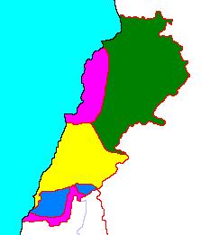

# La guerra sectaria de Israel contra el Líbano:
## parte 2

La guerra civil libanesa por sí misma da para escribir un libro, muy a grandes rasgos: debido a una serie de altercados entre facciones palestinas y la derecha cristiana que se salieron de control (una escalada de masacres en represalias que termina afectando a personas que son asesinadas simplemente por ser miembro de su comunidad), estalla la guerra civil libanesa, que si bien, en un principio podía considerarse como una guerra entre la derecha cristiana nacionalista libanesa y la izquierda panarabista, tomaría una dinámica cada vez más sectaria. Es importante destacar que se enfrentan dos proyectos nacionalistas incompatibles: el libanés, que reclama una identidad libanesa distinta a la del resto de árabes y aboga por un camino propio para alejarse de los conflictos regionales, y el panarabista, que reclama una identidad libanesa como parte de una gran nación árabe, comprometida con su causa (y en especial, la liberación de Palestina).

### Siria e Israel, los dos vecinos incómodos.

Israel tomó partido por la derecha cristiana liderada principalmente por maronitas, mientras que siria y el resto de países árabes apoyó mayormente a las facciones palestinas y musulmanas, aunque seguían teniendo relaciones con el gobierno libanés encabezado por los maronitas, no obstante, la guerra civil libanesa es un episodio bastante complejo, y las alianzas tomaron dinámicas inesperadas; Siria intervino en el 76 (a petición del gobierno, y en nombre de la liga árabe) con la excusa de proteger a los cristianos e intenta someter a grupos palestinos a su control de forma violenta (aunque algunas facciones eran pro-siria), Iraq, enemigo de Siria, también apoyó milicias cristianas en determinados momentos. De todas maneras, Siria al ser el único país árabe con frontera con Líbano fue el más influyente y no se retiró, instalándose principalmente en la zona norte y este del Líbano. interviniendo ampliamente durante la guerra civil.

Desde la perspectiva del gobierno baathista de Hafez al-Assad, Líbano es parte histórica de su país, teniendo una relación ambivalente respecto de sus pretensiones sobre el Líbano, pero otro de sus intereses en suelo libanés era debilitar y de ser posible suprimir a las facciones islamistas sunitas de la hermandad musulmana, cuya versión siria ya representaba una amenaza para su régimen.
#### Primera invasión israelí.

En el 78, Israel invade Líbano para atacar a las milicias palestinas instaladas en el sur del Líbano, lo cual fue relativamente fácil. Según cuenta Ury Avniery, la población chiíta no era especialmente hostil a los soldados israelíes, o al menos no mucho más que hacia los milicianos palestinos que ya les causaban problemas, y que siguiendo la hospitalidad árabe, incluso les ofrecían café. Él mismo cuenta que esto duró poco, y que fue debido al actuar de los israelíes como ocupantes, que despreciaban y abusaban de los libaneses sureños como de cualquier árabe, por lo que pronto empezarían a rechazar su presencia.

La invasión del Líbano duró poco, generó rechazo internacional y luego de unos meses y de expulsar a las milicias palestinas al norte del río Litani, se retiró, no sin antes dejar el poder en manos de milicias de derecha cristiana (Ejército del Sur del Líbano) en una "franja de seguridad" en el sur del Líbano que limita con Israel, a quienes apoyó económica y militarmente, además de darles entrenamiento militar, de esta forma, crearía un "estado tapón" que frenara las incursiones palestinas en el territorio del Estado israelí. Aunque el ejército israelí se "retiró", la verdad es que siguió interviniendo en la guerra civil en contra de las posiciones palestinas.

